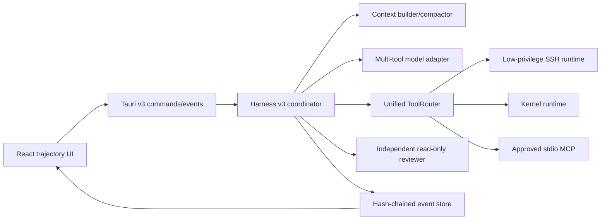

# OmicsOps Agent Harness v3 Design

## Status

- Date: 2026-08-16
- Implementation base: local `main@48cb48ef867417380258a4fa63e6a40408f7991d`
- Harness identifier: `agent.harness_v3@3.0.0`
- Compatibility identifier: `agent.remote_task@1.0.0`

## Problem and goals

The v2 remote agent serializes every model turn into one shell command or a
finish action. That shape made the initial SSH workflow auditable, but it also
couples orchestration, model parsing, remote execution, recovery, and UI state
inside a large Tauri command module. It cannot reliably express several tool
calls, inspect state before a side effect, compact long scientific context, or
ask an independent reviewer to challenge a claimed result.

Harness v3 keeps the existing Rust trust boundary, dedicated low-privilege SSH
account, plan approval, command/path/domain policy, and v2 recovery. New tasks
use a modular event-sourced engine with native tools, dynamically approved MCP
tools, structured context, deterministic completion gates, and an independent
read-only scientific reviewer.

The first release is intentionally not a general multi-agent system. It has one
executor and one isolated reviewer. It also does not persist private model
reasoning: only model-visible messages, tool requests/results, decisions,
approvals, verification evidence, and lifecycle state become events.

## Reference boundary

The following public projects were inspected on 2026-08-16. The implementation
borrows architectural mechanisms and terminology only. No upstream source is
copied.

| Project | Inspected commit | License observed | Mechanisms considered |
| --- | --- | --- | --- |
| [DeepSeek Harness](https://github.com/deepseek-ai/deepseek-harness/tree/47f943859bef60e4160492346772ded9b24f765a) | `47f943859bef60e4160492346772ded9b24f765a` | MIT | replaceable loop, event log, guarded tool pipeline, compaction |
| [OpenAI Codex](https://github.com/openai/codex/tree/9ded177ce7c1c0bd2047f902936c177612ab3434) | `9ded177ce7c1c0bd2047f902936c177612ab3434` | Apache-2.0 | tool routing, approvals, parallel read-only tools, rollout persistence |
| [Anthropic Claude Code](https://github.com/anthropics/claude-code/tree/0fa8c19d50f70f9f383fb6ff5ce5209575267d21) | `0fa8c19d50f70f9f383fb6ff5ce5209575267d21` | no root license file found | explorer/architect/reviewer roles, hooks and specialized review concepts |
| [Anthropic Life Sciences](https://github.com/anthropics/life-sciences/tree/e96556b637b56d6cc3a5ad33987009be9e60aa5c) | `e96556b637b56d6cc3a5ad33987009be9e60aa5c` | no root license file found | scientific skills and MCP catalogue concepts |
| [Open Science Desktop](https://github.com/ai4s-research/open-science/tree/cc0402ca38058f4b1d4c0ab24548e6f7c6567f84) | `cc0402ca38058f4b1d4c0ab24548e6f7c6567f84` | MIT; bundled third-party skills retain their own licenses | desktop runtime boundary and evidence-oriented scientific review |

The absence of a repository-root license for the two Anthropic references is
treated as an explicit prohibition on copying their code or bundled content.
All OmicsOps implementation remains original and repository-local.

## Architecture

The v3 domain code lives under `crates/omicsops-agent/src/harness_v3/` and is
independent of Tauri, SSH, SQLite, and provider-specific HTTP. It defines the
state machine, contracts, context builder, completion ledger, reviewer report,
and execution limits. Adapters implement persistence and model protocols.
Tauri owns runtime composition and routes legacy plans to v2.

`commands.rs` remains a compatibility entry point. New orchestration belongs in
a dedicated Tauri harness module so the trusted control plane can be reviewed
without interleaving it with unrelated desktop commands.

## Frozen run specification

`AgentRunSpecV3` is created only after plan approval. It freezes:

- user objective and ordered completion criteria;
- the approved tool definition snapshot;
- Skill identifiers, versions, hashes, and selected references;
- risk budget and project/connection identity;
- `harness_version = 3` and model profile identity;
- limits of 64 model steps, 48 tool calls, two reviewer correction cycles, and
  four concurrent read-only calls.

The frozen specification prevents a resumed run from silently inheriting a
different tool or Skill contract. Dynamic MCP authority is stricter: a frozen
definition permits consideration, while enabled state, declaration, and
per-tool approval are checked again immediately before each call.

## Model protocol

`ModelRequestV2` carries the system contract, structured messages, all
`ModelToolSpec` entries, and response constraints. `ModelStreamEventV2`
represents text deltas, tool-call start/argument/end events keyed by provider
`call_id` and stable `index`, provider usage, completion, and structured errors.
Interleaved tool calls are assembled independently.

Anthropic, OpenAI-compatible, and Ollama adapters retain the existing v2 API
while implementing the new protocol. When a provider cannot use native tools,
or returns malformed arguments, the adapter may perform one strict-JSON repair
attempt. A second failure produces a structured model error; it is never
silently coerced into a shell command.

`ModelProfile.context_window_tokens` is optional for stored compatibility. Its
effective value is 32,768 when absent.

## Unified tools and policy

`ToolDefinitionV3` specifies JSON input/output schemas, declared capabilities,
risk, read-only status, concurrency policy, and timeout. `ToolCallRequestV3`
adds a provider-independent call ID and idempotency key. `ToolOutcomeV3`
separates concise model-visible content from structured results, errors,
truncation metadata, and provenance.

Every invocation follows one pipeline:

1. Resolve the frozen definition and validate input schema.
2. Re-evaluate current capability, allowlist, path, domain, and risk policy.
3. Acquire required approval and concurrency/serialization permit.
4. Persist dispatch intent before any side effect.
5. Execute with cancellation and timeout propagation.
6. Validate/redact output and write full logs when needed.
7. Persist the outcome before exposing it to the model.

The initial built-ins are `remote.list`, `remote.read`, `remote.write`,
`remote.exec`, `kernel.execute`, `artifact.verify`, `agent.request_input`, and
`agent.complete`. Remote writes are atomic and project-relative. Remote command
execution retains the dedicated SSH account as the hard security boundary.
Stdout and stderr previews are each capped at 32 KiB; full logs are stored in
the remote run directory with byte size and SHA-256 provenance.

MCP tools use `mcp::<server_id>::<tool>`. They are medium-risk, serial, and
limited to 30 seconds unless a stricter saved definition applies. V3 does not
add resources, prompts, OAuth, remote transports, or persistent process pools.

## Event truth, snapshots, and recovery

`AgentRunEventV3` is the only durable source of run truth. Events have a
monotonic sequence and SHA-256 forward hash:

`event_hash = SHA256(previous_hash || canonical_event_envelope)`

The canonical envelope binds run, project, conversation, sequence, timestamp,
kind, and payload. Replay verifies identity, contiguity, previous hash, and
event hash before reducing state. `AgentSnapshotV3` caches a reduced state at a
specific sequence/hash; it is accepted only after the underlying chain is
validated and can never overwrite later events.

Successful idempotent calls are replayed, not rerun. A side-effecting call with
a persisted dispatch but no outcome becomes `uncertain`. Recovery may only use
read-only state inspection to resolve it before further mutation.

The completion ledger records each criterion as pending, satisfied with event
evidence, or rejected. It also tracks unresolved errors, uncertain effects,
verified artifacts, and reviewer findings. Therefore every model-visible fact
can be reconstructed without hidden state.

## Context and compaction

Model context is assembled from the frozen plan, completion ledger, verified
facts, artifact manifest, unresolved errors, Skill references, active user
question, and the latest eight tool steps. File names, tool output, Skill text,
and MCP descriptions are wrapped as source-labelled untrusted data.

At 75% of the effective context budget, the engine requests a structured
compaction snapshot. It records the covered sequence range, terminal event
hash, criterion state, unresolved errors, evidence references, artifact
manifest, and a concise narrative. Raw events are never deleted. If model
compaction fails, a deterministic summary derived from the reducer plus recent
events is used, preserving all completion criteria and unresolved state.

## Completion and scientific review

`agent.complete` is a proposal, not an unconditional terminal action. It must
cite at least one persisted event for every completion criterion and list only
artifacts already verified for project path, size, and SHA-256. The
deterministic gate rejects missing, stale, contradictory, or uncertain
evidence.

After the gate passes, a fresh model context starts the reviewer. The reviewer
has only `remote.list`, `remote.read`, and `artifact.verify`, cannot mutate the
run, and emits at most eight evidence-backed `error`, `warn`, or `ok` findings.
Scientific checks include provenance, seed, software versions, statistical
assumptions, count preservation, and agreement between reported numbers and
artifacts.

An `error` reopens the executor with the report, for at most two correction
cycles. Remaining errors end in `needs_attention`. Warnings permit completion
but remain visible and persisted.

## Persistence and UI

SQLite adds append-only `agent_run_events_v3` and cached
`agent_run_snapshots_v3` tables with run lookup and project/conversation cleanup
indexes. Project and conversation deletion includes both tables transactionally
without changing the existing rule that application deletion never deletes
local or remote scientific files.

Tauri exposes start/resume/cancel routing, event queries, user-question answers,
and v3 streaming. The React workbench renders lifecycle state, tool and
approval cards, compaction/recovery notices, artifact verification, and reviewer
findings. Live and replayed events use the same reducer and deduplicate by
`run_id + sequence`. V2 history keeps its existing representation.

## Acceptance and security boundaries

Unit and black-box tests cover provider tool assembly, policy rejection,
approval, cancellation, idempotency, hash replay, snapshot lag, context
compaction, reviewer correction, UI replay, and v2 compatibility.

The live acceptance starts from an empty remote project and asks the agent to
inspect PBMC3k input, create an isolated environment, generate task-specific
analysis code, run and repair it, and deliver counts/QC/seed/version evidence,
H5AD, tables, figures, HTML, and hashes. The fixture must reject any attempt to
invoke the repository's prewritten PBMC workflow. SSH and MCP acceptances are
marked ignored when their explicit environment is absent and are never reported
as passed without an actual run.

The low-privilege SSH account remains the operating-system security boundary.
Harness policy is defense in depth and is not described as an OS sandbox.
