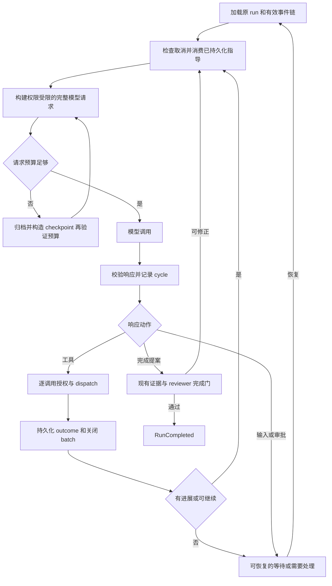

# 参考 wisp-science 的 OmicsOps Agent Loop 设计

日期：2026-09-08。状态：用户已要求按设计开发；已实现请求预算/一次 overflow 恢复、工具结果模型视图和按结果检测无进展。模型目录/准确图片成本和切片 4–6 仍待实施。不替代现有 V4 和 ordinary guided loop 契约。

## 1. 目标和范围

让普通科研 Agent 能在多轮工具使用、长上下文、用户追加指导和只读委派中持续推进，同时保持现有 Host 授权、证据验证和同 run 恢复。简单请求继续走 fast，多步骤科研任务继续走 multi_step；两者共享执行循环。

首个代码切片只实现完整模型请求的上下文预算检查；后续切片分别处理工具输出、无进展检测、委派和输入队列。不要一次重写 Runtime、Plan、浏览器或存储系统。

实施核查修正：当前 `model_catalog_shared.rs` 只有精确视觉能力表，没有完整 models.dev 上下文/输出规格目录。初版 `RequestBudget` 放在 adapters 的 provider 边界；core 通过 `ModelPortV4::validate_request` 委托同一预算逻辑，避免 core 的估算与最终 provider JSON 分叉。使用 profile 的现有 context window（未设置沿用 32,768 fallback），预留 4,096 输出和 1,024 安全量；它们是请求策略，不声称模型支持的最大输出。估算按最终 JSON 的 UTF-8 字节保守计数，实际图片成本未知则拒绝发送。完整规格目录、精确 tokenizer 和图片估算仍是待实现项。供应商明确的 `context_length_exceeded` / `context_window_exceeded` 触发一次归档压缩，只有请求变小时才重试；冻结状态不变且第二次失败停止。新协议错误类别为 `context_overflow`，旧事件继续可读。

实现采用 [OpenAI Chat API 的输出预算参数](https://developers.openai.com/api/reference/resources/chat)：精确官方 HTTPS host/443 使用 `max_completion_tokens`，兼容网关保留 `max_tokens`，不通过型号前缀推断能力。

工具视图在 `context_views.rs` 构造：正文最多约 8 KiB，大型 data 用引用替代，持久化事件不改写；可用的 `agent.read_tool_result` 按当前 run/project/conversation、sequence、event hash 和 UTF-8 边界验证后返回 4–8192 字节分页。仅有此 capability 的执行上下文启用投影，Plan 不暴露工具。checkpoint 中的工具近期记录也保留引用；科学状态和未解决错误不静默截断，仍过大时预算保护会停止。

`progress.rs` 从持久化 outcome 重建最多 32 个 observation；批次必须关闭且结果齐全才计入，比较规范参数、成功标记和结果，忽略根级 transport timing 字段。旧 `repeated_signature_limit` 配置沿用为重复 observation 阈值（至少 2）；用户回答/科学状态变化重置窗口。初版直接返回 needs-attention，未增加额外的模型修正轮次。截断响应、空响应和无 terminal marker 的流均不作为成功工具轮次。

用户要求本次工作中的简单任务和子 agent 使用 Luna、max 推理。它是开发执行偏好，不自动成为 OmicsOps 产品的默认模型。产品侧如需同样策略，应通过可配置 profile 绑定，并校验供应商精确模型 ID 和支持的推理档位；不把 Codex 内部模型别名直接写进供应商请求。

## 2. 参考证据

通过 GitHub 插件读取 `xuzhougeng/wisp-science`，固定参考提交为 `31cc9457876b1f44d45542c27a82bc035f167bbb`。以下为实际读取的实现，不把 README 或设计愿景当作运行结果。

| 参考源码 | 已观察到的机制 | OmicsOps 采用方式 |
| --- | --- | --- |
| [agent.rs L282–395](https://github.com/xuzhougeng/wisp-science/blob/31cc9457876b1f44d45542c27a82bc035f167bbb/crates/wisp-core/src/agent.rs#L282) | 每轮吸收 guidance；计算工具 schema 预算；归档优先压缩；上下文溢出允许一次压缩重试 | 使用 V4 durable events 和模型请求预算；压缩不改变授权或证据 |
| [agent.rs L402–480](https://github.com/xuzhougeng/wisp-science/blob/31cc9457876b1f44d45542c27a82bc035f167bbb/crates/wisp-core/src/agent.rs#L402) | 分开处理截断、异常结束、空响应；没有工具调用时返回 Completed | 借鉴错误分类；OmicsOps 仍必须通过 agent.complete，不能直接把纯文本当完成 |
| [agent.rs L620–664](https://github.com/xuzhougeng/wisp-science/blob/31cc9457876b1f44d45542c27a82bc035f167bbb/crates/wisp-core/src/agent.rs#L620) | 控制型工具使同批后续调用失效；按调用与结果检测重复后缀循环 | 增加明确的 skipped outcome 和有界无进展检测；不能仅按参数判断卡死 |
| [context.rs](https://github.com/xuzhougeng/wisp-science/blob/31cc9457876b1f44d45542c27a82bc035f167bbb/crates/wisp-core/src/context.rs) | 归档、checkpoint、近期尾部、工具 schema 估算、usage 校准、压缩失败抑制 | 保留 OmicsOps 事件真相源；摘要仅用于模型工作上下文 |
| [subagent.rs L85–172](https://github.com/xuzhougeng/wisp-science/blob/31cc9457876b1f44d45542c27a82bc035f167bbb/crates/wisp-core/src/subagent.rs#L85) | explore 自有上下文，仅 read/grep/search，主 agent 收结论、统计、trace 路径 | 演进现有 DelegatedTaskNodeV4；不要新增并行的委派系统 |
| [agent_turn.rs L1366–1465](https://github.com/xuzhougeng/wisp-science/blob/31cc9457876b1f44d45542c27a82bc035f167bbb/src-tauri/src/agent_turn.rs#L1366) | 队列与单 driver 协调；排队项可 cut-in；未消费指导可回队 | 采用单 driver 思路，OmicsOps 的接收/消费须持久化且可恢复 |

不照搬 wisp 的无工具即完成、reasoning 字段存储、普通文本归档或固定 trace 保留期。OmicsOps 的凭据约束、公开摘要规则和科研证据保留要求优先。

## 3. 当前实现与边界

本地审查基线为 `cb76415344733af3e2659124e766872373bfd0da`。以当前工作树为准，而非 AGENTS.md 中可能滞后的布局描述：

- `crates/omicsops-agent-core/src/lib.rs`：`AgentCoreV4`、`execute_with_limits`、`context_for`、`execute_delegation_graph`、`execute_delegated_node` 是主要落点。已有 route/shape/phase、cycle/batch、审批、独立 review、checkpoint 和 uncertain dispatch 恢复。
- `AgentLimitsV4` 已有轮数、调用数、重试、上下文字节、委派并发/深度/节点预算。应复用，不新建另一套无限循环。
- `context_for` 当前比较序列化 context 的字节长度；超过阈值后先归档事件再写 checkpoint。该处未计算完整 system、工具 schema、图片和输出预留，压缩后的返回值也没有在该处再次检查大小。
- `execute_delegated_node` 已限制只读工具和输出 schema，但使用 `self.model`；工具反馈逐轮加入字符串列表。独立模型绑定、上下文限额和精简父级投影应在此演进。
- 实际桌面组合位于 `src-tauri/src/agent_v4.rs` 的 `compose` / `DesktopModelPortV4`，命令另见 `agent_commands.rs`。当前工作树没有 `src-tauri/src/agent_turn.rs`，不要按参考项目路径直接建同名旁路。
- 协议类型放 `omicsops-protocol`，UI 边界对象走 `omicsops-dto`；存储用现有 repository/event/checkpoint 路径。`omicsops-agent` 的 provider 适配与 V4 Host 职责分开。

## 4. 共享循环

压缩回路必须有界：每个请求至多一次自动压缩和一次供应商确认的 overflow 恢复；压缩后仍超限直接返回明确的预算错误，不能在图中的 E/C 间无限往返。预算失败、空响应、网络错误、无进展和主动取消是不同原因，均不能写成完成。

普通 fast/multi_step 仍遵守 [ordinary guided loop](ordinary-agent-guided-loop.md)。discovery、MCP 优先、浏览器来源门禁、只读 task list、公开进度和 approved_plan 隔离均保留。此次不把固定门禁改成仅提示词建议。

## 5. 请求预算与上下文

建议新增一个纯数据 `ModelRequestBudgetV4`（初始可留在 core，跨边界时再进入 protocol）：context window、最大输出、输出预留、估算输入、估算来源、图片估算是否已知。模型规格由现有精确目录查询提供，core 不访问网络，也不做型号家族猜测。

预算不变量：`estimated_input + reserved_output + safety_margin <= context_window`。输入必须覆盖 system、上下文、全部工具定义、图片和适配器附加格式。最终 provider 层在发送前复核；仅检查 core JSON 不能宣称检查了线上实际请求。未知图片成本使用供应商保守上界，无法界定时返回预算不可确定，不按零计算。输出预留受模型最大输出约束。未知模型沿用现有未知规格策略，不新增伪造窗口值。

先保留现有 context_max_bytes 作为内存保护，再增加 token 预算。tokenizer 可用时按实际编码估算，否则标注保守估算；供应商 usage 只用于后续校准，不当作本轮调用前已知事实。初期阈值配置化，先通过测试/验收校准再确定默认比例。

压缩保留原目标、明确修正、未完成任务、科学状态、来源引用、pending approval/input、uncertain dispatch、阶段和最后有效序号。摘要不能更新 frozen plan、权限或 completed 状态。保存顺序为归档成功 → checkpoint 持久化成功 → 使用新上下文；任何失败保留旧投影和完整事件。重试使用稳定的 run/sequence/revision 标识避免重复归档。

工具大结果区分原始受控资产、持久化脱敏 outcome、模型短视图。短视图含摘要、项目相对引用、大小和 hash；截断保证 UTF-8 边界和 call/result 关联完整。重新读取按项目权限验证，不能仅凭路径恢复任意内容。大型远端数据保留元数据/校验和及远端引用。压缩绝不能把凭据或私有 CoT 写进所谓完整 trace。

## 6. 进展、暂停与长计算

在完整 batch 的 outcomes 落库后计算 observation，包含工具 ID、规范化参数、成功/错误类别及语义结果摘要。时间戳、耗时等波动字段不作为进展；远端任务状态/输出版本变化必须作为进展。检测有界的连续重复后缀，覆盖 A/A/A 和 A/B/A/B 等情况。

首次无进展可给一次结构化修正反馈；达到配置上限后记录停止原因并返回需要处理。用户有效指导、任务状态变化或新证据重置 observation 窗口。重复失败不能靠换 call_id 或模型宣称“进展”绕过。恢复时从已完成事件重建窗口，避免重启后无限重试。

长计算沿用 runtime/compute 的结构化运行记录：提交得到 handle → 持久化 → 等待状态变化 → 收集产物 → 科学验证。loop 暂停等待不持续消耗模型轮数，不放大 shell timeout。Stop 停止当前 agent 派发/等待；取消远端 job 是单独的已授权操作。失联保留状态未知，不自动重提计算。

## 7. 子 agent

2026-09-08 实现边界：子请求全量序列化字节默认不超过 64 KiB（同时受父 context_max_bytes 限制），输出 JSON 不超过 8 KiB；原始工具数据进入子反馈时一并计数，过大则失败并保留完整结果，而非无依据截断。父事件视图去掉完整 tool_outcomes，保留输出/状态/调用统计与可分页的 node/graph trace 引用。恢复仅复用精确 graph 和成功依赖链中的成功节点。整个 run 的委派累计预留默认 32 轮/64 次工具；失败图重启保守地再预留整图额度，与主循环限额分开。

Settings 新增可选只读子 profile 绑定。ordinary run 创建时把 profile ID 与精确执行配置 hash 冻结进 RunSpecV4/spec_hash；compose 验证同一配置快照再构造 child ModelPort。旧 spec 不带字段时 hash 保持兼容，approved_plan 禁止新增角色绑定。主 profile 后续更改选择不影响运行中的任务；子 profile 的 provider/URL/精确 model ID/能力/窗口变化会拒绝恢复。标签和凭据轮换不影响 hash。尚未提供推理档位或自动主模型切换，不将配置选择宣称为 max 生效。

继续使用现有委派 DAG、只读 capability 交集、独立目标/依赖和 schema 验证。子 agent 只接收工作所需上下文；工具结果放它自己的有界上下文。父 agent 默认只接收结构化结论、证据引用、状态、调用/usage 统计与 trace 引用；完整子事件保留在受控存储，不整段重灌父上下文。

拟增加按角色选择 ModelPort 的 resolver：主执行、只读委派、reviewer。兼容路径先继承当前 profile；显式配置角色绑定时严格解析，不可用则明确报错，不能偷偷改模型。主模型升级只发生在模型边界；保持 run identity，追加选择事件。approved_plan 的模型变更必须符合冻结 spec 契约，不能把普通 Agent 的切换机制套进去。

如用户另行选择产品内的 Luna/max 策略，profile 应保存真实 provider/API host/model ID、requested/effective reasoning 和能力来源；不支持 max 时报告配置冲突，不能把 max 改称已生效。模型选择不会扩大 capability。reviewer 保持现有独立规则，子 agent 自报成功不能替代主 run 验证。

取消向子节点传播；成功节点按精确输入/schema/能力绑定复用，失败节点可恢复，活动节点不盲目重放。节点预算和父 run 总预算共同生效，防止委派使调用次数或成本无界增长。

## 8. 运行中指导与持久化

当前实现使用独立 agent_guidance_v4 表保存 accepted/consumed 状态，包含 message_id、run_id、顺序和时间；消费时校验完整冻结 spec。客户端重送同一 message_id 幂等；只能在模型边界或已关闭工具 batch 后消费，消费记录与 GuidanceConsumed 事件在同一事务提交。每 run 最多 16 条、每条 2048 UTF-8 字节；仅运行中的 ordinary Agent 可接收新指导。收到指导可打断模型等待；主循环未完成的 ReadOnly 工具等待同样可以切入，已完成结果仍保留；副作用工具先收口，不伪造取消。完成事务拒绝未消费指导；checkpoint 保留已消费指导的上下文。

排队新任务与指导当前 run 分开；每个会话只有一个 driver，槽位获取与队列操作原子协调。关闭窗口、重启、消费前崩溃都能恢复未消费输入。指导不得悄悄改 frozen approved plan；超出授权范围保持现有修改/审批路径。

新增协议字段采用可选/default，旧事件可读取，迁移幂等。新增事件要同步更新归约、hash/sequence 校验、store、checkpoint、DTO 和 UI 投影，不能仅在前端显示一个不可恢复的状态。本文不预先指定新 SQL 表，以免重复现有事件存储。

计算任务基础现已使用独立 runtime_jobs_v4 元数据表：每 run/call_id 的持久化启动占用绑定请求 hash 和执行上下文，任务 ID 区别于解释器会话 ID；事件事务将取消或不确定派发转为 unknown，恢复不自动重跑。结果只存 request_id 与摘要，证据仍沿用 ToolFinished/归档。进程内后台 worker 已接入桌面 runtime.execute，通过事件通知等待并共享终态结果；等待者退出不重复启动，显式中断保持未知语义，注册表上限 128 条。已完成结果使用临时回执（最多 1 MiB）与任务终态原子提交；工具事件提交时回执原子删除。过期运行的全部未完成派发均有可验证回执时，桌面提供原 run 的“恢复已保存结果”，沿用冻结配置和科学验证。明确不确定与终态运行不自动重开。仍在运行的远端进程查询、重连和自动挂接尚未实施。

## 9. 平台、界面与安全

Windows 使用现有无控制台后台进程策略和 Windows 路径处理；macOS 使用原生路径/进程策略。SSH/WSL 通过对应 ExecutionContext 执行，不能假设本地有 bash、nohup 或 kill。run-owned 资源清理不得影响用户其他计算或浏览器窗口。

UI 显示执行、等待输入、等待审批、等待计算、上下文整理、需要处理和完成；进度只展示公开摘要。模型角色与生效档位在详情可查，不把 token/hash 等实现细节塞进普通任务操作。新增可关闭详情层必须接入窗口级 Escape 堆栈并测试立即 Escape 只关顶层。

所有工具逐次通过现有审批/路径/来源校验。keyring 是凭据唯一存储路径；事件、SQLite、日志、checkpoint、子 trace 和导出都只保存安全引用或脱敏内容。保留 uncertain dispatch 及人工核验语义。

## 10. 验证与交付标准

确定性测试使用 fake model、fake ToolPort、临时 EventStore、固定时间和本地合成资产。覆盖完整预算及压缩后仍超限、归档失败、同 run 恢复、巨大/中文结果、空/截断响应、重复循环与正常监控、委派上下文/权限/预算、指导幂等和 driver 竞争。保留 fast、research、Plan、审批、reviewer 与 uncertain dispatch 回归。

实现时先近邻测试，再 `cargo test --workspace`、`npm test`、`npm run build`。若变更桌面组合或打包，再运行 `npm run build:desktop`。真实模型/SSH/R/Micromamba/PBMC 按 acceptance/README.md 的一次性环境执行，ignored 不能报告通过。

首个切片完成标准：能够在任何模型请求发送前可靠发现预算超限，保留原 run/事件并给出可恢复原因；压缩不会丢失授权或证据，不改变普通任务与 approved_plan 语义。后续切片逐个达到独立验收标准再启用。

## 2026-09-09 增量：显式推理档位请求

ModelProfile JSON 新增可空 reasoning_effort，无表迁移或凭据字段。共享 SaveModelProfileRequest 省略保留/null 清空/字符串设置；native 在合并旧配置后再次验证协议和值，再写 keyring/数据库。仅 OpenAI-compatible 支持该请求字段，Anthropic/Ollama 显式设置时拒绝，绝不静默忽略。此字段表示请求值，不是模型能力或服务端确认的生效值；不增加前缀/家族匹配，不将 Codex Luna/max 身份当成任意服务的已验证型号。

统一客户端对常规模型、独立子模型、结构化调用、重试和非流式 fallback 保留同一 reasoning_effort，完整预算覆盖该字段。probe 同样发送，显式档位默认预留 4096 输出 token（沿用已有运行请求额度，非模型上限），已有 RequestBudget 优先，并拒绝明确的截断/拒答响应。wire 字段参考 [OpenAI Chat API](https://developers.openai.com/api/reference/resources/chat)；可选字符串不代表所选精确模型支持这些档位。

显式值加入子模型 execution_configuration_hash，未设置时不改变旧哈希。角色仍按既有冻结绑定验证；主模型沿用既有 profile 加载语义，不新增跨恢复的主模型配置快照。Windows/macOS 使用同一设置与适配器路径，无覆盖层/审批/隔离/数据驻留变化。完整 models.dev 精确能力目录、requested/effective/capability source 审计，以及自动简单任务模型路由仍待实施。

## 2026-09-09 增量：主模型配置冻结

在显式档位增量基础上，新建 ordinary run 的 RunSpecV4 增加可空 model_configuration_hash，使用 ModelProfile.execution_configuration_hash。与子模型绑定从同一主 profile 快照冻结，字段纳入 spec_hash 和已有 RunSpecFrozen 事件锚点。省略字段时保持旧序列化/哈希；只允许 ordinary 且有 compute selection 的规格携带 64 位十六进制指纹，不回填旧运行，不改变 approved-plan 审批绑定。

compose 在建立 SSH/解释器资源前读取并验证主 profile；后续凭据引用、模型请求、视觉标志和预算都从同一拥有的快照构建，不再二次加载 profile。恢复发现执行配置不符时拒绝，提示恢复原设置或创建新运行；不自动降档、替换 profile 或重写已冻结规格。label 和凭据引用不进入指纹，允许重命名及 keyring 密钥轮换；子模型绑定由独立冻结字段控制。该增量覆盖主模型配置重现性，不确认服务端实际 effort，也不实现远端任务重连。

没有新表、凭据存储或 UI 覆盖层；Windows/macOS 共用相同验证路径。旧程序计算不含新字段的 spec_hash 会失败，不能让旧版本跳过完整性检查恢复新规格。

## 2026-09-09 增量：取消待恢复运行

新增 agent_v4_cancel_runtime_recovery 命令，复用 run_id 参数及已有事件契约。桌面先取得现有 driver 槽位，活动执行/恢复检查占用时拒绝该请求。Store 在 BEGIN IMMEDIATE 中仅允许 waiting_for_input 且最后事件为 RuntimeRecoveryAvailable 的运行转为 cancelled；RunCancelled 和两份 status（列/JSON）同事务写入。已完成的同一次取消返回原事件，其他暂停、已继续执行或其他终态不被覆盖。job 元数据及回执保留审计，不启动解释器、不生成 ToolFinished、不将结果视作已通过科学核验。

界面内联提供“取消此运行”，与恢复共用点击锁和 DesktopApp 的会话/run 操作锁；提交失败可重试，RunCancelled 收口后隐藏两项动作。恢复在取得 driver 槽位后重新检查取消事件，以处理 compose 等待期间取消已提交的竞态，失败时释放槽位；不改变原有失败运行的兼容恢复。Windows/macOS 使用同一路径，无覆盖层、额外审批、数据库迁移或凭据字段变化。真实远端运行中的中断/重连和其他暂停类型取消不属于此增量。

## 2026-09-09 增量：子 Agent 指导等待切入

ordinary graph 的节点接收父 run_id，仅用于检查持久化指导收件箱。开始新模型轮次、派发/接收工具结果时检查；模型/只读工具等待沿用 50 ms 取消检查间隔观察指导。发现 pending 时未完成节点返回 Failed，挂起读取保留 guidance_interrupted 失败 outcome、空 provenance；既有成功节点及该节点已完成的工具结果保留，失败依赖节点为 Blocked。收件箱错误也停止节点，保留其失败原因，即便下一次查询恢复也不会继续旧请求。

节点不消费指导、不追加事件、不更改全局 cancelled；父调度器在 join 收口后仍按原顺序持久化 NodeFinished/GraphFinished/ToolFinished，主循环随后按原事务消费 GuidanceConsumed 并重新决策。预算预留不退款、工具能力不扩张，approved-plan 节点不观察 ordinary 指导。无新协议字段、数据库迁移、UI 覆盖层、凭据或远端驻留变化；Windows/macOS 共用 core 实现。此行为放弃本地等待，不宣称远端服务已经停止执行，不影响 runtime 副作用工具等待策略。
