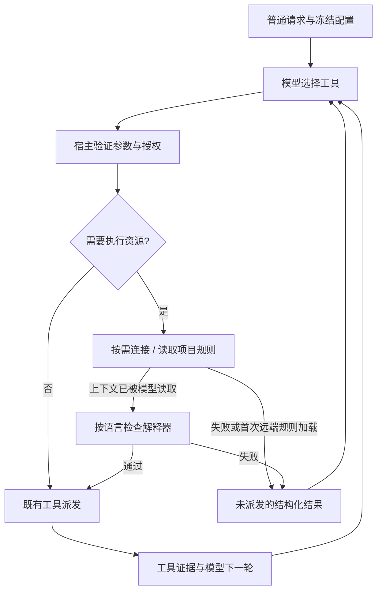

# 第二阶段：普通 Agent 按需准备执行资源

日期：2026-09-10。承接第一阶段提交 `99938f6`。用户要求提交第一阶段并继续第二阶段；
本阶段消除普通文献任务对计算连接的启动依赖。保留 V4，Workflow 与 ACP 留待后续。

## 用户可观察行为

- Local / SSH 后端列表只读取配置与信任关系，Python/R 初始为 unverified。
  selectable 表示配置可选择；descriptor.available=false 表示运行可用性尚未核验。
  不因缺少解释器或离线 SSH 阻止普通请求发送。未信任、未绑定或无本地根目录仍不能选择。
- 普通 Agent admission 与恢复不打开 SSH，也不探测解释器。检索、Memory、Skills、
  MCP 与浏览器遵守各自连接和审批规则，不需要计算后端初始化。
- project.list/read、数据集文件校验、artifact.verify 与 runtime 工具按需初始化选定后端。
  文件读取不要求 Python/R；runtime.execute/rebuild 在 Local / SSH 检查本次使用的语言。
- 只有用户填写容器镜像时做 image inspect；使用前再次核对冻结 image ID。
  容器解释器与依赖仍需实际运行验证，不在准备阶段额外启动探测容器。
- Plan/已批准计划继续提前组合上下文，沿用 revision/hash 与批准流程。

## 内部边界

桌面 ExecutionResourcesSlotV4 使用 OnceCell 缓存成功初始化的资源；并发调用不会重复
建立成功会话。失败不缓存，后续调用可重试。工厂持有项目与 compute selection 快照，
使用前重新核对项目路径/连接绑定、主机信任、凭据引用和容器 image ID。
不会回退到本地或替换冻结环境。凭据仍只从既有 keyring 读取，不写入日志或事件。

ToolPortV4 / ToolExecutorV4 新增默认无操作的 prepare_call 接口，不引入新模型工具、
crate 或数据库迁移。Host 在授权之后、science_before_tool 和 ToolDispatchStarted
之前调用该接口；它仅做只读准备，不能执行用户代码、创建环境或启动内核。
准备超时为 30 秒，取消会结束等待。失败/上下文屏障返回 succeeded=false、
operation_dispatched=false 和可恢复类别，进入下一轮；不生成运行或科研结果证据。
已有实际派发后的不确定恢复语义不变。

首次 SSH 初始化会加载远端 AGENTS.md / .omicsops/AGENT.md，替换模型的项目规则层。
初始普通对话使用本地规则，并明确远端规则尚未加载。读取提示词或做预算检查不解除屏障；
只有成功返回的模型轮次确实携带该远端规则与环境层，才允许后续远端调用。
同批尚未看见规则的远端请求全部延后。审批仍绑定每条实际调用，不能继承另一次调用授权。

## 验证与限制

确定性测试覆盖普通 SSH composition 在无凭据、无真实服务情况下成功，Memory 查询及
取消不连接；目录列表未验证状态可发送；初始化失败不缓存且不泄漏原始错误；并发只初始化
一次；规则屏障不会因预算检查提前放行；按语言检查失败不预留运行结果；新调用与恢复
路径的准备均在科研登记和正式派发前，且需先授权；超时与取消不派发。

不新增已建立 SSH 会话的自动重连，恢复同 run 时重新组合资源；不实现后台作业自动轮询、
跨重启内核恢复、Workflow 或 ACP。解释器可找到不代表科研依赖齐全。准备阶段之后发生的
启动/执行故障仍按既有运行时规则处理，不把不确定结果擅自改成已取消或安全重跑。

手工 smoke（待真实环境）：Windows 在无 Python/R 的 Local 与离线可信 SSH 配置发送
文献请求，确认可进入模型与检索；访问远端文件后观察规则加载和下一轮调用；恢复连接后
重试资源初始化；取消初始化等待；另开 Plan 会话核对生成、修订和批准流程。
真实模型、SSH、浏览器、macOS 与依赖安装验收尚未执行，按 acceptance/README.md
一次性环境要求另行验证，不能用模拟测试或安装包构建替代。

## 实际验证

Windows 上实际执行：

- `cargo test --workspace`：406 项通过，11 项 ignored。
- `npm test`：145 项前端测试、22 项扩展测试通过。
- `npm run build`：通过；仍有既有 Vite 大于 500 kB chunk 提示。
- `npm run build:desktop`：通过，生成本地 NSIS；未安装或分发。
- `cargo fmt --all -- --check`、`git diff --check`：通过。
- 真实模型/SSH/浏览器/macOS smoke：未执行；一次性验收环境未配置。

初次定向检查遇到测试夹具字段与界面文案断言未同步，修正后上述全量检查通过。
